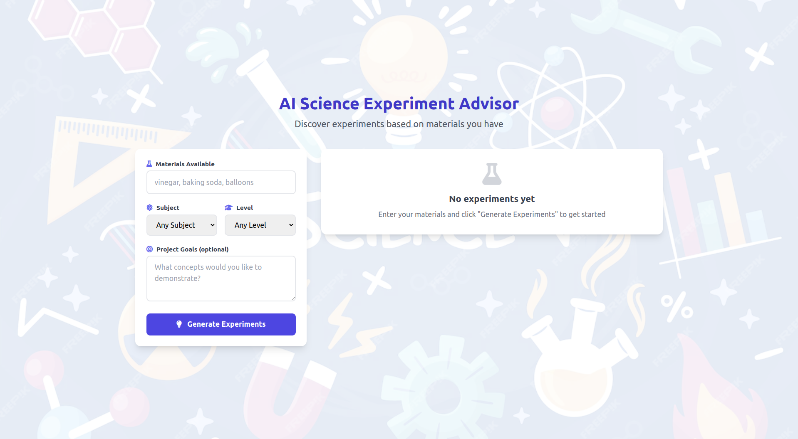

# 🧠 AI Science Experiment Advisor

An intelligent system designed to guide students and researchers in planning and conducting science experiments. This AI-powered tool suggests relevant experiments, materials, and methodologies based on user input.



---

## 🚀 Features

- 🔍 Experiment recommendation based on subject and grade level
- 📋 Material and resource checklist generator
- 💬 Interactive chatbot for instant experiment guidance
- 📊 Real-time suggestions using natural language processing (NLP)

---

## 📸 Demo


> Note: Replace the `images/interface.png` with your actual image path or URL.

---

## 🛠️ Tech Stack

- Python 🐍
- OpenAI GPT / NLP Libraries
- Flask or Django (Backend)
- HTML/CSS/JS (Frontend)
- SQLite / MongoDB (Database)

---

## 📦 Installation

```bash
git clone https://github.com/Himanshu12315603/AiProjectScience.git
cd AiProjectScience
pip install -r requirements.txt
python app.py

